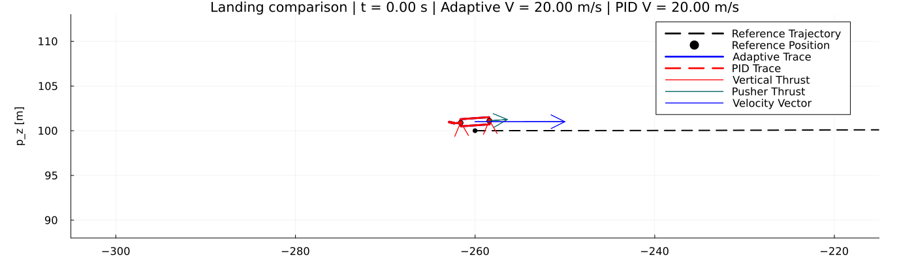
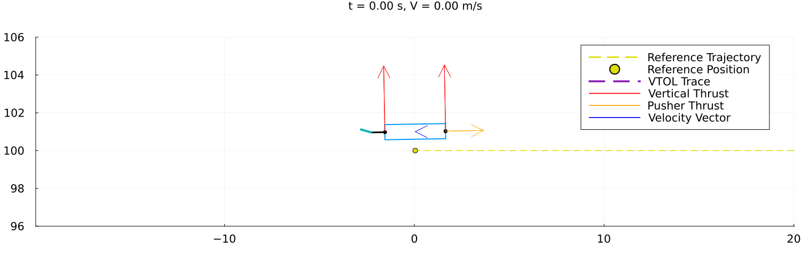
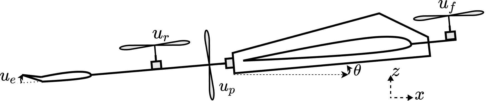

# adaptive-control-underactuated

## Running the Code

From the repository root, start Julia and activate the project environment:

```julia
] activate .
] instantiate
```

The main entry point is `run_simulation.ipynb`. Open that notebook, choose the scenario and controller mode in the setup cell, then run the notebook cells from top to bottom.

Useful files:

- `run_simulation.ipynb`: main simulation, plotting, and comparison workflow.
- `vtol.jl`: nonlinear VTOL dynamics model.
- `high_level_control.jl`: reference trajectories and high-level acceleration commands.
- `control_allocation.jl`: adaptive control allocation and reduced dynamics model.
- `simulation.jl`: simulation callbacks, adaptive controller integration, and PID benchmark.
- `animation.jl`: animation helpers.

## Animations

### Landing Comparison



### Takeoff


## Vehicle Dynamics



Let $p = [x,z]^\top$, $v = [\dot{x},\dot{z}]^\top$, $V = \lVert v\rVert$, $\gamma$ be the flight-path angle, $\alpha = \theta-\gamma$, and $\omega = \dot{\theta}$. The control input is $u = [u_f,u_r,u_p,u_e]^\top$, where $u_f$ and $u_r$ are the normalized front and rear vertical propeller speeds, $u_p$ is the normalized pusher propeller speed, and $u_e$ is the elevator deflection.

Define the body-axis propulsive force components and wind-axis aerodynamic force components as

$$ F_p = T_{\max,p}u_p^2,\qquad F_v = T_{\max,v}\left(u_f^2 + C_{pr}(V,u_p)u_r^2\right). $$

$$ D = \frac{1}{2}\rho S V^2 C_D. $$

$$ L = \frac{1}{2}\rho S V^2 C_L + \frac{1}{4}\rho S\bar{c}V C_{L_\omega}\omega. $$

The full nonlinear translational dynamics are

$$ \ddot{x} = \frac{1}{m}\left(F_p\cos\theta - F_v\sin\theta - D\cos\gamma - L\sin\gamma\right). $$

$$ \ddot{z} = \frac{1}{m}\left(F_p\sin\theta + F_v\cos\theta - D\sin\gamma + L\cos\gamma\right) - g_z. $$

The full nonlinear pitch dynamics are

$$ \ddot{\theta} = \frac{1}{J}\left(\frac{1}{2}\rho S\bar{c}V^2 C_M + \frac{1}{4}\rho S\bar{c}^2 V C_{M_\omega}\omega + l_vT_{\max,v}\left(u_f^2 - C_{pr}(V,u_p)u_r^2\right)\right). $$

The aerodynamic coefficients are

$$ C_D = C_{D_0} + C_{D_\alpha}\alpha^2 + C_{D_e}u_e + C_{D_t}(u_f+u_r). $$

$$ C_L = C_{L_e}u_e + (1-\sigma(\alpha))(C_{L_0}+C_{L_\alpha}\alpha) + \sigma(\alpha)2\,\operatorname{sgn}(\alpha)\sin^2(\alpha)\cos(\alpha). $$

$$ C_M = C_{M_e}u_e + (1-\sigma(\alpha))(C_{M_0}+C_{M_\alpha}\alpha) - \sigma(\alpha)2\,\operatorname{sgn}(\alpha)\sin^2(\alpha)\cos(\alpha). $$

The stall blending function is

$$ \sigma(\alpha) = \frac{1 + e^{-M(\alpha-\alpha_{\rm stall})} + e^{M(\alpha+\alpha_{\rm stall})}}{\left(1 + e^{-M(\alpha-\alpha_{\rm stall})}\right)\left(1 + e^{M(\alpha+\alpha_{\rm stall})}\right)}. $$

The rear propeller effectiveness is

$$ C_{pr}(V,u_p) = 1 - \kappa_{pr}u_p^2\left(1+\frac{V}{V_{pr}}\right). $$

## Model Parameters

The model parameters are listed below.

| Parameter | Value | Units | Description |
| --- | ---: | --- | --- |
| $g_z$ | 9.81 | m/s^2 | Gravitational acceleration magnitude |
| $m$ | 10.0 | kg | Vehicle mass |
| $J$ | 1.0 | kg m^2 | Pitch-axis moment of inertia |
| $l_v$ | 0.5 | m | Distance from center of mass to each vertical propeller |
| $T_{\max,v}$ | 100.0 | N | Maximum vertical propeller thrust scale |
| $T_{\max,p}$ | 50.0 | N | Maximum pusher propeller thrust scale |
| $\rho$ | 1.225 | kg/m^3 | Air density |
| $S$ | 0.5 | m^2 | Reference wing area |
| $\bar{c}$ | 0.2 | m | Reference chord |
| $C_{D_0}$ | 0.043 | - | Zero-lift drag coefficient |
| $C_{D_\alpha}$ | 0.03 | 1/rad^2 | Angle-of-attack drag coefficient |
| $C_{D_e}$ | 0.0135 | 1/rad | Elevator drag coefficient |
| $C_{D_\omega}$ | 0.1 | - | Rotational drag coefficient |
| $C_{D_t}$ | 0.8 | - | Drag coefficient contribution from vertical propeller throttle |
| $C_{L_0}$ | 0.23 | - | Zero-angle lift coefficient |
| $C_{L_\alpha}$ | 5.61 | 1/rad | Lift slope |
| $C_{L_e}$ | 0.13 | 1/rad | Elevator lift coefficient |
| $C_{L_\omega}$ | 7.95 | - | Pitch-rate lift coefficient |
| $C_{M_0}$ | 0.0135 | - | Zero-angle pitching moment coefficient |
| $C_{M_\alpha}$ | -2.74 | 1/rad | Pitching moment slope |
| $C_{M_e}$ | -0.99 | 1/rad | Elevator pitching moment coefficient |
| $C_{M_\omega}$ | -38.21 | - | Pitch-rate moment coefficient |
| $\alpha_{\rm stall}$ | 15.0 | deg | Stall blending angle |
| $M$ | 50.0 | - | Stall blending sharpness |
| $\kappa_{pr}$ | 0.5 | - | Rear propeller interaction coefficient |
| $V_{pr}$ | 80.0 | m/s | Rear propeller interaction velocity scale |
